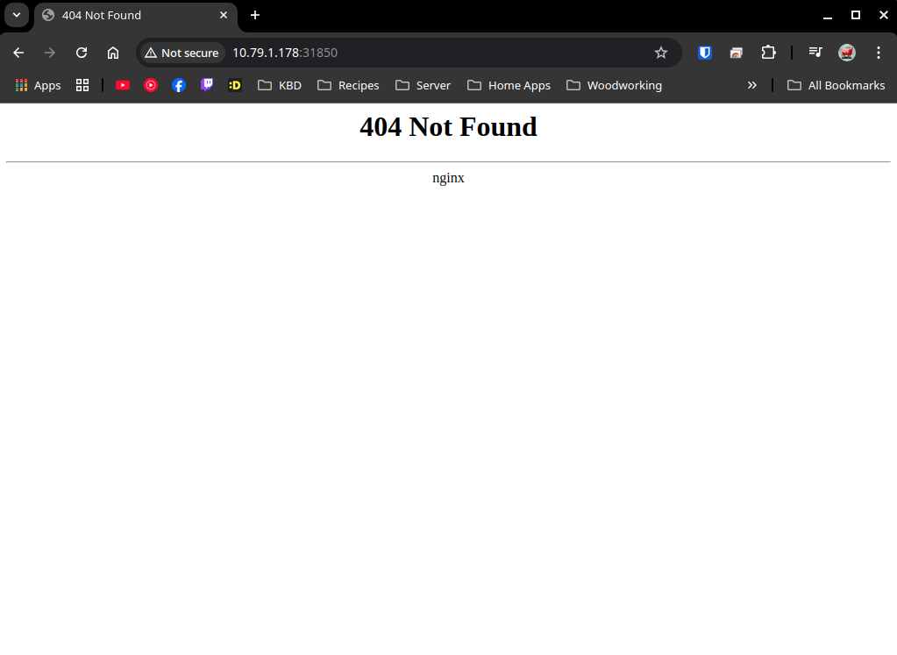

# [nginx-INGRESS](https://kubernetes.github.io/ingress-nginx/deploy/#bare-metal-clusters)
## ingress-nginx is an Ingress controller for Kubernetes using NGINX as a reverse proxy and load balancer.

Where metallb is a loadbalancer service that deals with address allocation and external announcement, an [ingress](https://kubernetes.io/docs/concepts/services-networking/ingress/)

        exposes HTTP and HTTPS routes from outside the cluster to services within the cluster

since you can expose an ingress on a `nodePort`, you could just have a node that hosts the ingress controller - In zmh-green and zmh-dev I played with hooking metallb up to do this job - where the controller is assigned an IP in the network by metallb. I've got no idea if this is ideal, or what the cost is of doing it this way, it worked well enough when I needed it.

I also used `Kind: Endpoint` objects to weasel the ingress controller into serving up my NAS and other external objects via public DNS records. Also worked pretty well, no clue what complaints I will have about this later.

- another situation where I pulled the manifest directly into local - helm is recommended, so I'll refactor this eventually

## 20240214

pulled `v1.8.2`

## 20240226

changed line [365] from type NodePort to type LoadBalancer - so that metallb loadbalances the service to be exposed to LAN

## 20250312

pulling `v1.12.0`

- `kind: endpoint` manifests have been replaced with `endpointSlices` and I haven't messed with those enough. removing those entries for now, will experiment later

## 20250317

Brits out

there is apparently a [bare metal version](https://kubernetes.github.io/ingress-nginx/deploy/#bare-metal-clusters) of this controller that I.. guess I linked above but didn't follow. Linking again for the idiots in charge of this operation

- metallb will assign IP addresses to kubernetes objects from the IPAddressPool
    - for ease of use, just setup a `default` class ipaddress pool and set it to `autoAssign: true`

when you set, say ingress-nginx-controller `spec.type: Loadbalancer` you get an external-ip assigned
```
NAME                                 TYPE           CLUSTER-IP      EXTERNAL-IP   PORT(S)                      AGE
ingress-nginx-controller             LoadBalancer   10.43.126.229   10.79.8.1     80:31850/TCP,443:30381/TCP   20h
```

in the current state, this address does not resolve to the nginx controller, 
- if you assign an ingress to the nginx controller
```
grafana:
  service:
    type: "ClusterIP"
  ingress:
    enabled: "true"
    ingressClassName: "nginx"
    hosts: ["grafana.blue.chillpickles.digital"]
```

the ingress gets a node ip assignment
```
NAMESPACE    NAME                                       CLASS   HOSTS                               ADDRESS       PORTS AGE
monitoring   kube-prometheus-stack-1742191049-grafana   nginx   grafana.blue.chillpickles.digital   10.79.1.178   80    20h
```

- that is a node IP address, and if you check out the nginx ingress controller, this ingress would be handling traffic over NODEPORTS - the `external-ip` set on the controller is not respected at all, we're gonna be going to the Node IP, and to the port mapped above `31850`



This is not ideal, in order to run public DNS that resolves services internal to the LAN, I'd like to have a single point where I can point an A record. This is how metallb is supposed to work, so I am doing something wrong. I realize this is now MetalLB config issues, but I'm slicing at the ingress controller, so this is where it needs to come from

oookay, so I updated the annotation on the ingress-controller service from `IPAddressPool` to `address-pool` and that didn't so anything.. so I went poking into the fucking network configuration?

Turns out if an IP address is outside of the fucking range of the network, the router won't fucking take you there. Fucking subnet issues forreal?? Figured it out when I could hit the nginx page from the rpi node in the homelab subnet, but couldn't hit it from my desktop :upside_down_face:

coolio